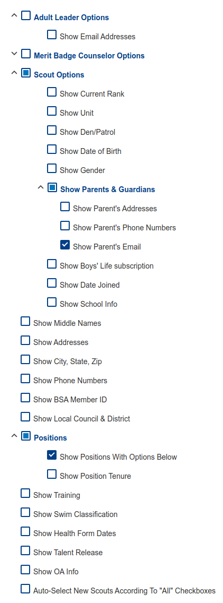

to use:
download a roster report and call it roster.csv. make sure you use set up your roster like this:

export/backup your troops advancement csv and call it advancement.csv

type `python3 audit.py`

